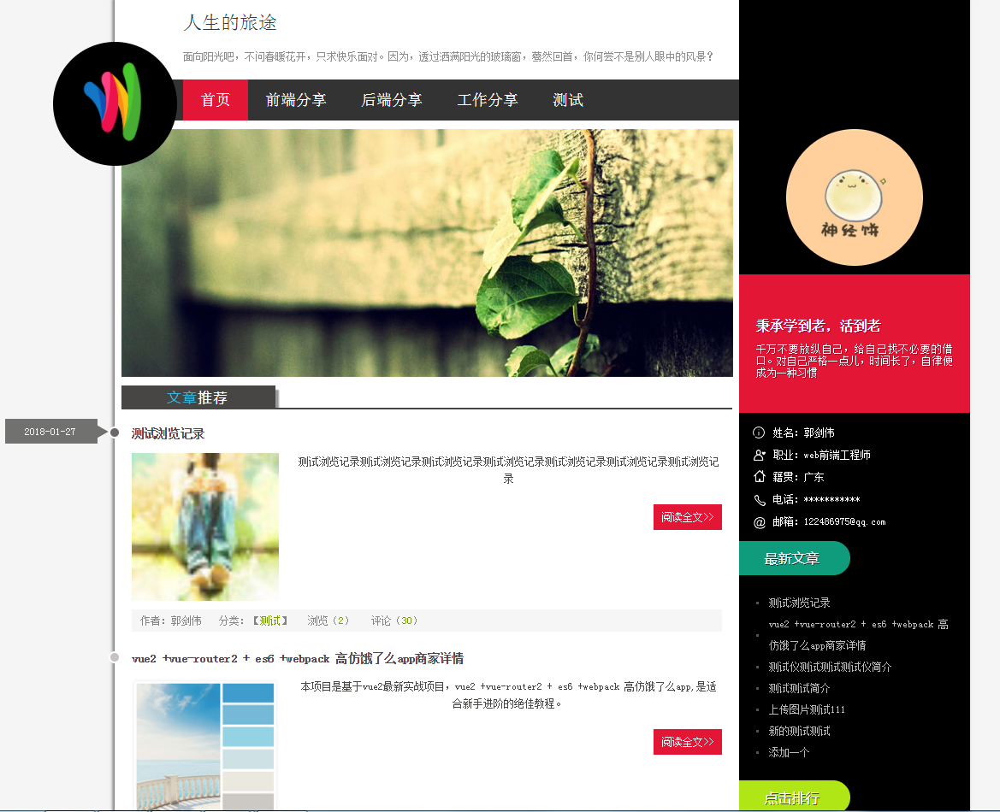

## 个人博客系统 --- 前台页面部分

> 分为三部分: 

1. 前台： 博客页面
2. 后台： 博客管理页面
3. 后台： 博客后台服务器

****

### 项目简介

> 项目已前后端分离开发。分别用到的框架如下:
* 前台页面用nuxt + axios开发  
GITHUB源码地址:  [blog-website-nuxt](https://github.com/oxgos/blog-website-nuxt)

* 后台页面用vue2 + axios + vue-router + element-ui开发  
GITHUB源码地址:  [blog-admin](https://github.com/oxgos/blog-server-web)

* 后台服务器nodejs + express + mongodb开发  
GITHUB源码地址:  [blog-server](https://github.com/oxgos/blog-server)

****

### 项目预览图




****

### 完成功能
1. 用户信息
2. 文章列表分页
3. 用户上传头像
4. 最新文章排行
5. 文章浏览数排行
6. 页面布局

****

### TODO
1. 用户注册功能
2. 用户评论功能
3. 文章分页
4. 页面动画
5. seo优化

****

``` bash
# 安装项目依赖
npm install

# 启动项目于localhost:8888
npm run dev

# 项目打包
npm run build

# build for production and view the bundle analyzer report
npm run build --report
```
